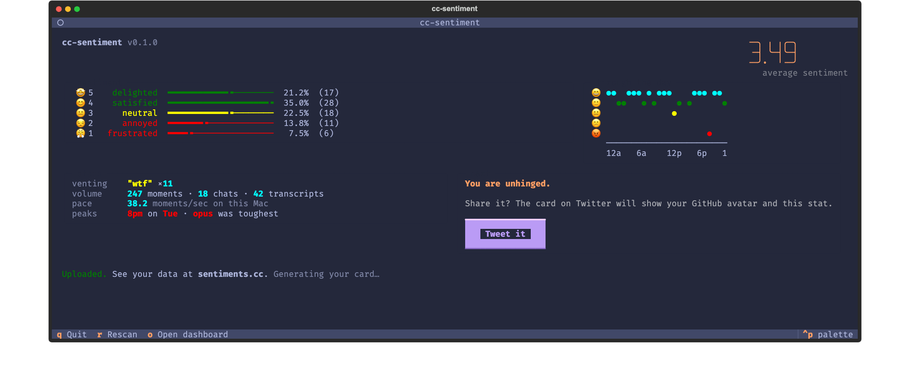

# cc-sentiment

[](https://pypi.org/project/cc-sentiment/)
[](https://www.python.org/downloads/)
[](client/LICENSE)

An open experiment in Claude Code behavior. Contributors run a CLI that scores their own Claude Code transcripts locally, and uploads the numbers to a shared dashboard at [sentiments.cc](https://sentiments.cc).



## Why

Claude Code threads like [anthropics/claude-code#42796](https://github.com/anthropics/claude-code/issues/42796) describe behavior that shifted in measurable ways: fewer reads before edits, more lazy patches, different tool patterns. Everyone sees their own slice. This pools the numbers so they can be looked at together.

## Run it

```bash
uvx cc-sentiment
```

Needs [uv](https://docs.astral.sh/uv/). The first run links your GitHub account, scores any transcripts it finds in `~/.claude/projects/`, and uploads the numbers.

## What gets uploaded

The client records the following per 5-minute slice of each conversation.

| Metric | What it captures |
|---|---|
| Sentiment score | 1–5, scored locally |
| Read:edit ratio | Files Claude reads before editing |
| Edits without prior read % | Edits to files Claude hadn't read this session |
| Write:edit ratio | File rewrites vs. surgical edits |
| Tool calls per turn | Tools invoked between user messages |
| Subagent spawns | How often Claude delegates to a subagent |
| Turn count | User → assistant exchanges |
| Thinking present / chars | Whether and how much Claude wrote extended thinking |
| Claude model | Which model produced the assistant turns |
| `cc_version` | Claude Code CLI version |

Plus your GitHub handle, so uploads are attributable.

## What stays on your machine

Conversation text, file contents, file paths, tool inputs, and tool outputs never leave the device. Scoring is local. Only the numbers above are uploaded.

## Architecture

```
┌─────────────┐         ┌─────────────┐         ┌─────────────┐
│   client/   │  POST   │   server/   │  fetch  │    app/     │
│  local CLI  │────────▶│  Modal API  │◀────────│  SvelteKit  │
│  MLX+Gemma4 │ signed  │ TimescaleDB │  SSR    │  dashboard  │
└─────────────┘ upload  └─────────────┘         └─────────────┘
```

## CLI commands

| Command | Description |
|---------|-------------|
| `cc-sentiment` | Interactive TUI. Sets up if needed, then scores and uploads. |
| `cc-sentiment setup` | Re-run the setup wizard. Auto-detects and links an existing key when possible, otherwise walks through picking or generating a signing key with honest verified / pending / failed end-states. |
| `cc-sentiment run` | Score new transcripts and upload. Non-interactive; safe for cron, SSH, and launchd. |
| `cc-sentiment install` | Schedule a daily background run via launchd. |
| `cc-sentiment uninstall` | Stop and remove the scheduled run. |

## Development

See `AGENTS.md` for conventions. Each component has its own: `server/AGENTS.md`, `app/AGENTS.md`, `client/AGENTS.md`.

## License

[MIT](client/LICENSE)
